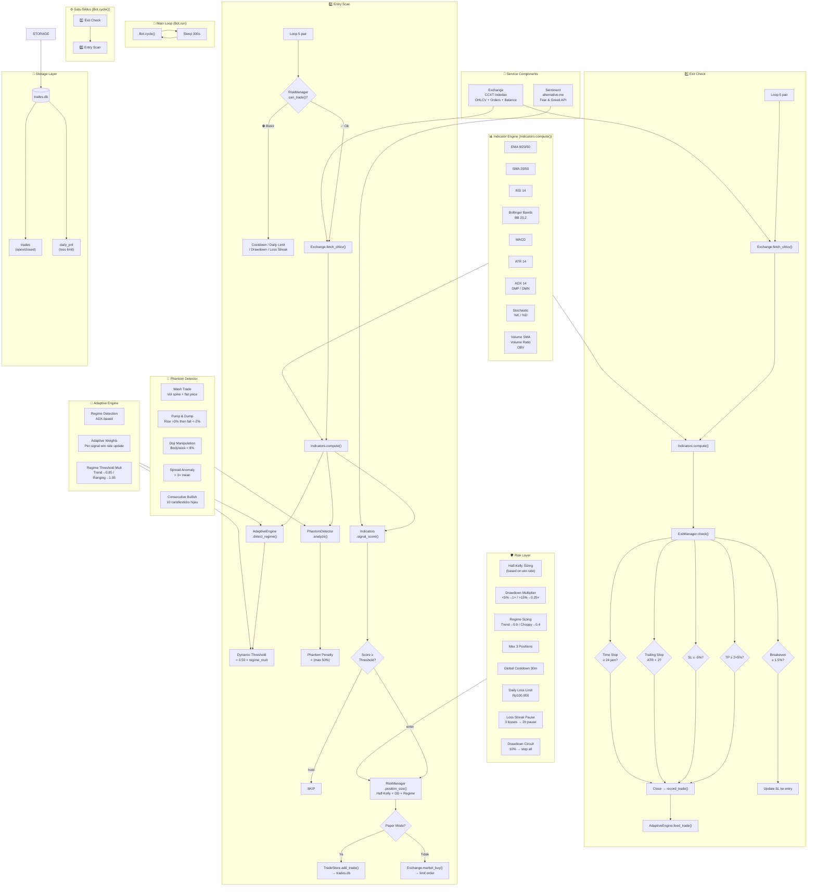

# Indodax Trading Bot — Arsitektur



## Alur Program

```
┌─────────────────────────────────────────────────────┐
│                  Bot.run()                          │
│   Loop selamanya → Bot.cycle() → sleep 300s        │
└───────────────────┬─────────────────────────────────┘
                    │
    ┌───────────────┴───────────────┐
    │         Bot.cycle()           │
    │                               │
    │  1️⃣ Scan 5 pair untuk EXIT    │
    │    └ ExitManager.check()      │
    │      → TP / SL / Trailing     │
    │        / Breakeven / Time Stop│
    │      → Close trade → feed     │
    │        ke AdaptiveEngine      │
    │                               │
    │  2️⃣ RiskManager.can_trade()   │
    │      → Cooldown / Drawdown    │
    │        / Daily Limit / dll    │
    │                               │
    │  3️⃣ Scan 5 pair untuk ENTRY   │
    │      → fetch OHLCV            │
    │      → compute indicators     │
    │      → detect regime          │
    │      → phantom check          │
    │      → signal_score()         │
    │      → if score ≥ threshold:  │
    │        position_size() → entry│
    └───────────────────────────────┘
```

## Komponen Scoring

```
Score =  trend    × 25%
       + momentum  × 20%
       + mean_rev  × 20%
       + volume    × 15%
       + sentiment × 15%
       + stochastic ×  5%
       ─────────────────
       Total (max 1.0)

       Dikali phantom_penalty (max -50%)
       Lalu dibandingkan dengan dynamic_threshold
```

## Alur Exit

```
Setiap cycle → untuk setiap pair open:
  1. TP?  (pnl ≥ 2 × 5% = +10%)    → CLOSE
  2. SL?  (pnl ≤ -5%)               → CLOSE
  3. Trailing? (pnl > 0, price - 2×ATR < entry) → CLOSE
  4. Breakeven? (pnl ≥ 1.5%)         → UPDATE SL ke entry
  5. Time Stop? (≥ 24 jam)           → CLOSE
```

## Alur Entry

```
Setiap cycle → untuk setiap pair (max 3 positions):
  1. can_trade() check
  2. fetch OHLCV 1h (100 candles)
  3. compute() → EMA/SMA/RSI/BB/MACD/ATR/ADX/Stoch/Volume
  4. detect_regime() → ADX-based
  5. analyze_phantom() → 5 anomaly detektor
  6. signal_score() → weighted confluence
  7. Score ≥ dynamic_threshold?
     → position_size() via Half-Kelly × DD × Regime
     → Paper: simpan ke DB
     → Live: limit order via CCXT
```
